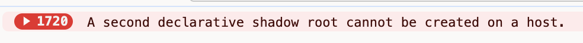
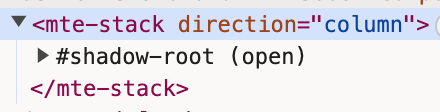
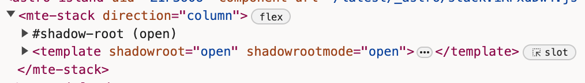

Repo with an example astro page build that results in specific error.

## About the page

This is a very simple page that loads a few Lit web components that have been SSR'd with `@astrojs/lit` at build time. This page renders these elements 100+ times so that the page is excessively large in order to trigger the issue reliably.

Elements used here are from our internal library. It is not a public library and I cannot share all of it here. That is why this is only a single test page from our build to showcase this issue.

The version of Astro used to render this page was `4.5.9` but it occurs on any version of Astro `4.x.x`. It does not occur on any version of Astro `2.x.x`. We never were able to test any Astro `3.x.x` versions.

## Installing Dependencies

We cannot publish our internal library publicly. For debugging this issue, I've temporarily included a build of some of our packages in this project. They are installed locally and not from a remote registry.

NPM seemingly does not link dependencies with these local packages properly, but PNPM does. **To test out this issue, please use PNPM or you will run into issue with multiple versions of Lit being loaded.**

## Triggering the issue

1) To trigger the issue, serve this page locally. You can even trigger the issue in dev mode depending upon your machine: ```pnpm run dev```

2) Next open the page in a chromium browser (the issue occurs in other browsers, but I have note tested recreation with other dev tools network throttling).

3) In the dev tools, from the `network` tab select `Throttle > Fast 3G`.

Reload the page and, after a few seconds, you should see the following errors start racking up:



You should also be able to build the project and serve it with throttling to see the same issue. This issue occurs on some of our docs page becaus of real world latency for normal loads and not just on ultra-slow speeds.

## About the issue

Each element here is SSR'd with a declarative shadow root (DSD). Once loaded on the page, they should "adopt" their DSD as their own shadow root. You can tell this has happened successfully when the element has finished loading and only has a shadow root. The DSD `<template>` is "gone" because it is now the elements shadow root.



With the conditions above though, due to something about how Astro is loading components here, part way down the page issues start arising. Every component past a certain point loads with the "second declarative shadow root" error. If you look at these components (scroll half way down the dom) you will see a shadow root and an "unadopted" DSD `<template>`. The SSR'd content is in the unadopted DSD template, but the component has initalized its own shadow root already.



> NOTE: Today web component only have a declarative option for rendering html content, they cannot consolidate styles during SSR. This leads to a page that is very large due to duplicate styles, but that gzips very well. There is not solution for this at this time and is expected behavior.

This seems to be some kind of timing issue related to when JS loads and the size of the page. 

If there is enough JS being loaded and the page is large enough this will trigger _sometimes_. Depending upon your machine, loading this without network throttling will not result in the issue. I do not know enough about how Astro is loading things to understand why this could be happening.

If I recreate this example with only a single web component however, the issue does not occur not matter how many instances of that element I SSR onto the page.